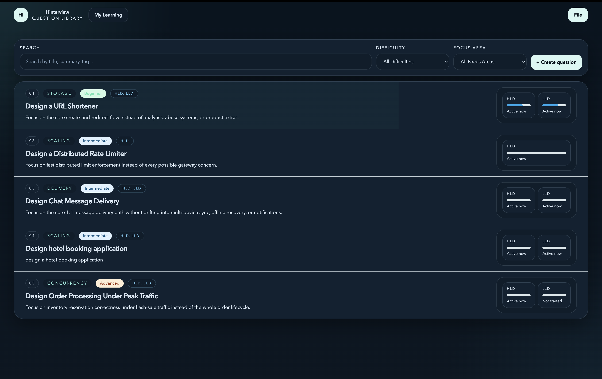
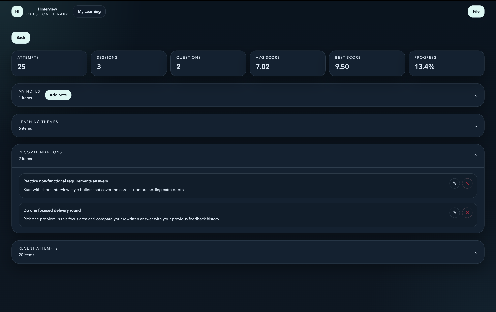
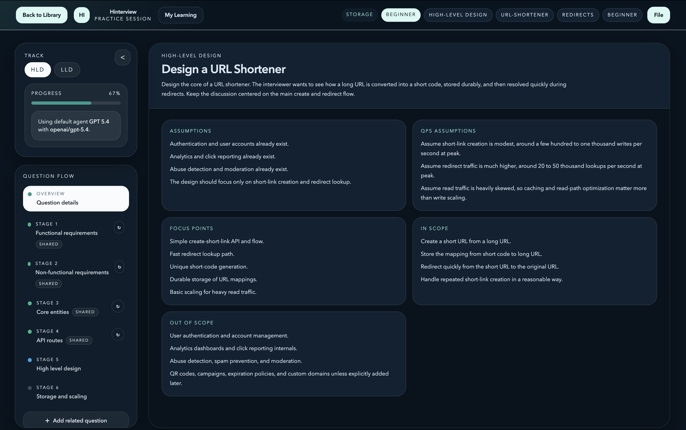
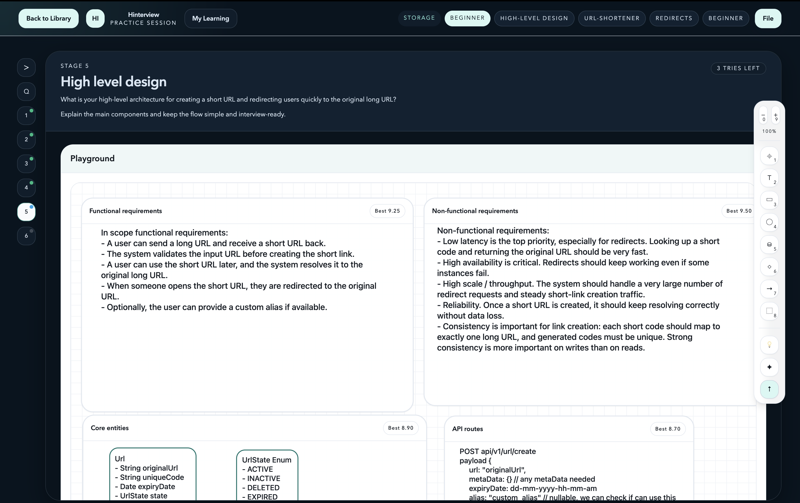
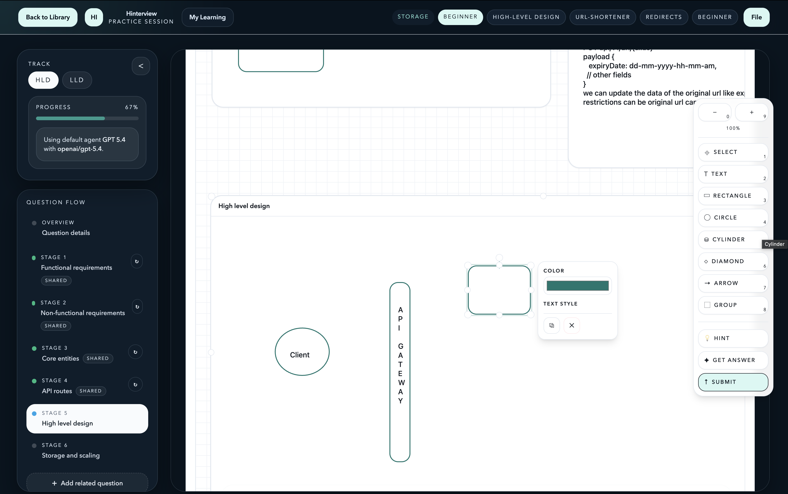
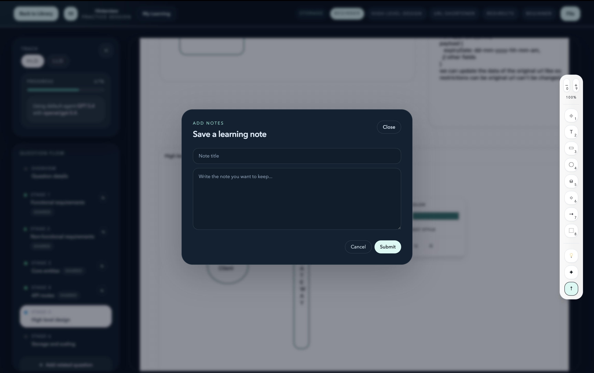
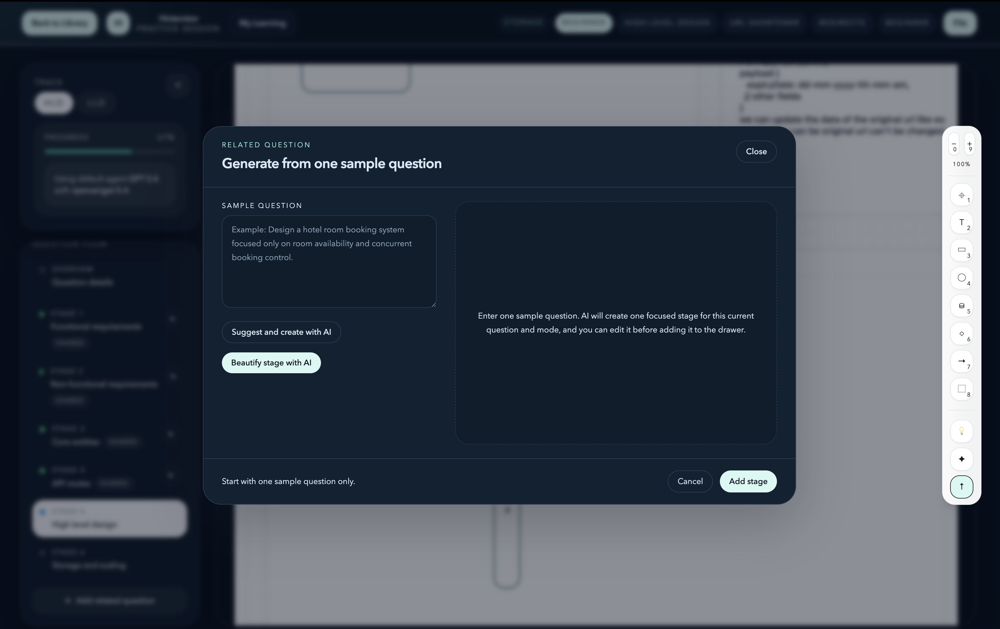
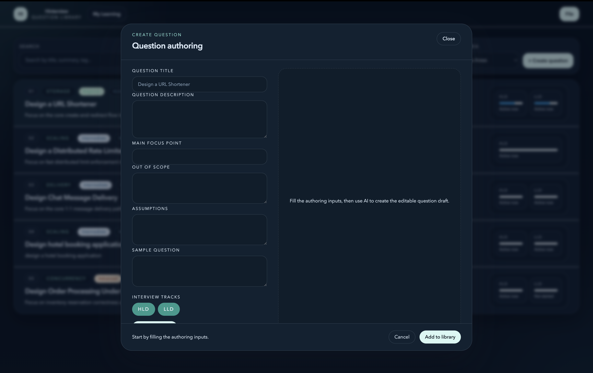
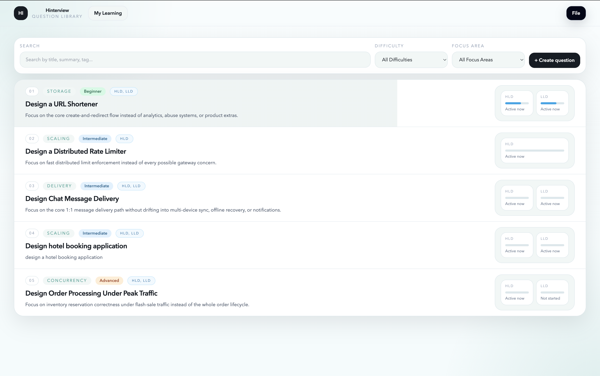

# Hinterview

Practice system design interviews with guided questions, AI feedback, a shared diagram playground, and local-first progress tracking.

## ✨ What It Is

Hinterview is a desktop + web app for practicing:
- `HLD`
- `LLD`
- or both on the same problem

It gives you:
- staged interview questions
- AI hints and scoring
- a common canvas/playground
- learning review
- custom question generation

## 🧩 Main Features

### Interview Flow
- Shared question library
- Search and filters
- Difficulty sorting
- Stage locking and ordered progression
- Retry and redo support
- Shared stages across HLD and LLD where relevant

### AI Support
- Multiple AI providers
- Encrypted local API key storage
- Hint, answer, and evaluation actions
- Score out of `10.00`
- Pass threshold at `8.00`

### Playground
- Text boxes
- Rectangle, circle, cylinder, diamond
- Arrows
- Move, resize, rotate, group select
- Per-stage containers inside one shared canvas
- Autosave and restore

### Learning
- Recent attempts
- Learning themes
- Recommendations
- Personal notes

### Custom Content
- Create a full custom question
- Beautify with AI
- Add custom stages to existing questions
- Suggest the next stage with AI

### App Experience
- Dark mode
- Desktop + web support
- Local SQLite persistence
- Migration ledger
- Error boundary and retry states

## 🖼️ Screenshots

### Product Gallery

<table>
  <tr>
    <td align="center">
      <div><strong>Question Library</strong></div>
      
    </td>
    <td align="center">
      <div><strong>Question Detail</strong></div>
      
    </td>
    <td align="center">
      <div><strong>Playground and Evaluation</strong></div>
      
    </td>
  </tr>
  <tr>
    <td align="center">
      <div><strong>Shared Question Flow</strong></div>
      
    </td>
    <td align="center">
      <div><strong>My Learning</strong></div>
      
    </td>
    <td align="center">
      <div><strong>Learning Themes and Notes</strong></div>
      
    </td>
  </tr>
  <tr>
    <td align="center">
      <div><strong>Settings and Agent Profiles</strong></div>
      
    </td>
    <td align="center">
      <div><strong>Custom Question Flow</strong></div>
      
    </td>
    <td align="center">
      <div><strong>Dark Mode</strong></div>
      
    </td>
  </tr>
</table>

## 🏗️ Workspace

- `apps/renderer` → React + Vite UI
- `apps/server` → Express + SQLite API
- `apps/desktop` → Electron shell
- `packages/shared` → shared schemas and seeded questions
- `codex` → PRD, milestones, release docs

## 🚀 Run It

Install:

```bash
npm install
```

Web:

```bash
npm run dev:web
```

Desktop:

```bash
npm run dev
```

Build:

```bash
npm run build
```

Tests:

```bash
npm run test
```

Release checks:

```bash
npm run release:check
```

## 💾 Persistence

- SQLite DB: `.data/hinterview.sqlite`
- Secret key: `.data/secret.key`
- API keys are encrypted at rest
- Some renderer cache is also kept in local storage

## 📚 Docs

- [PRD](./codex/PRD.md)
- [Milestones](./codex/milestones.md)
- [Release checklist](./codex/release-checklist.md)
